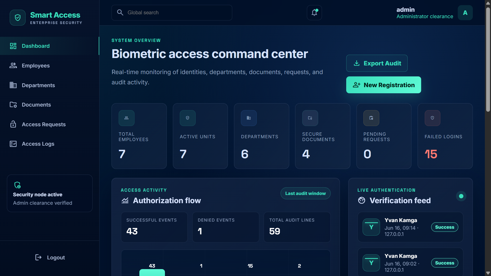
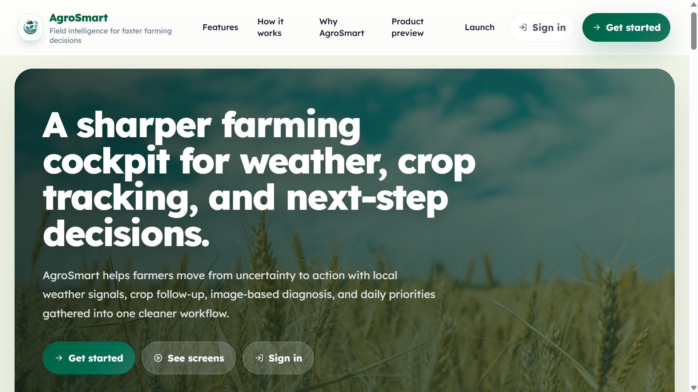
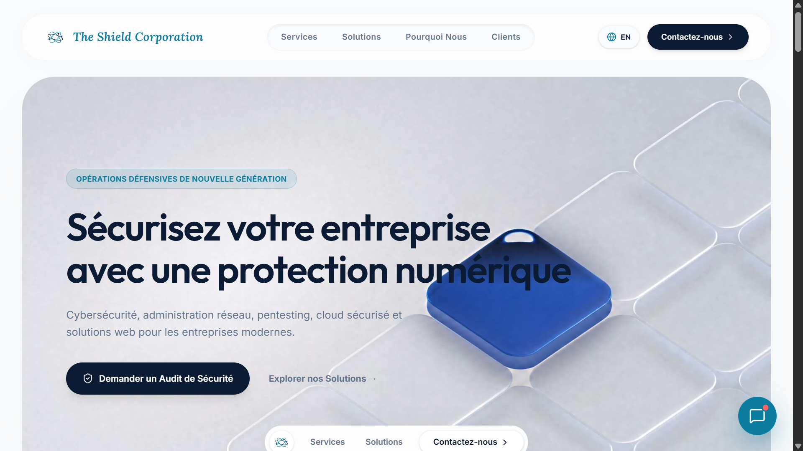

# Emeryc Djomo

**Full-stack developer focused on modern web platforms, secure interfaces, and practical digital products.**

I build responsive applications that connect clean user experiences with useful backend logic.

 

 
 

---

## Professional Summary

I am a developer building full-stack web applications, dashboards, landing pages, and secure digital tools. My strongest current direction is the development of modern web platforms with **React**, **TypeScript**, **Tailwind CSS**, **Django**, **Express**, and database-backed application logic.

My public work shows a focus on practical products: secure document access, intelligent agriculture, portfolio interfaces, e-commerce experiences, carpooling simulations, productivity tools, and cybersecurity service websites.

---

## About Me

- I work mainly on full-stack web applications and modern frontend experiences.
- I build interfaces with React, TypeScript, Tailwind CSS, and animation-focused UI patterns.
- I have worked on backend-oriented projects using Django, Python, Express, Supabase, PostgreSQL, and local service integrations.
- I am interested in secure systems, role-based access, document management, cybersecurity-oriented interfaces, and SaaS-style products.
- I am currently improving my backend, deployment, cloud, and cybersecurity foundations through practical projects.

---

## Main Technical Skills

**Frontend engineering:** React, TypeScript, JavaScript, Vite, Tailwind CSS, responsive UI, component-based interfaces.

**Backend and application logic:** Django, Python, Node.js, Express, authentication flows, role-based access, API-driven applications.

**Databases and storage:** PostgreSQL, Supabase, local file/document storage concepts.

**Security-oriented development:** facial authentication, department-based permissions, audit logs, access workflows, secure document preview concepts, cybersecurity service presentation.

**Tools and deployment:** Git, GitHub, Vercel, Docker basics, npm, project documentation.

---

## Technology Badges

### Languages

### Frontend

### Backend, Data, and Security

### Tools and Deployment

---

## Featured Projects

### Smart Access

**Problem:** companies need a secure way to control access to internal documents based on employee identity and department permissions.

**What it does:** Smart Access is an enterprise document access management system built with Django. It includes facial authentication, employee enrollment, department-based authorization, protected document delivery, exceptional access workflows, secure previews, versioning, and audit logs.

**Main technologies:** Django, Python, PostgreSQL, HTML, CSS, JavaScript, OpenCV, face recognition.

**Status:** public repository, academic/professional MVP.

[Repository](https://github.com/Emryc-dev/Smart-Access)

  

---

### AgriMétéo / AgroSmart

**Problem:** farmers need clearer access to weather signals, crop follow-up, diagnostics, and next-step decisions.

**What it does:** AgriMétéo is a smart farming platform for weather, crop tracking, image-based diagnosis, user dashboards, community features, notifications, and administration workflows.

**Main technologies:** React, Vite, TypeScript, Tailwind CSS, Node.js, Express, Supabase, PostgreSQL, PWA concepts, weather API.

**Status:** live web project provided through portfolio materials.

[Live website](https://agrimeteo.vercel.app/)

  

---

### The Shield Corporation

**Problem:** cybersecurity and IT service companies need a credible website that explains services clearly and converts visitors into qualified prospects.

**What it does:** The Shield Corporation is a professional bilingual website for cybersecurity, network administration, pentesting, web audit, cloud computing, secure hosting, cyber consulting, and secure web development services. It includes responsive navigation, animated service cards, testimonials, chatbot interactions, and calls to action.

**Main technologies:** React, TypeScript, Vite, Tailwind CSS, Framer Motion / Motion, Lucide React, Vercel.

**Status:** live web project provided through portfolio materials.

[Live website](https://shield-corpration.vercel.app/)

  

---

### Portfolio

**Problem:** developers need a focused place to present projects, skills, visual direction, and contact options.

**What it does:** a personal portfolio built with TypeScript and modern frontend tooling. It presents selected projects, visual experiments, statistics, contact links, and interactive UI sections.

**Main technologies:** TypeScript, React, Vite, Tailwind CSS, animation and interactive UI libraries.

**Status:** public repository with live deployment configured on GitHub.

[Repository](https://github.com/Emryc-dev/Portfolio) · [Live website](https://portfolio-amber-psi-94.vercel.app)

<!-- Add a portfolio screenshot here when the final deployed design is ready. -->

---

### CarPooler

**Problem:** professional carpooling needs clear role-based flows for passengers, drivers, and administrators.

**What it does:** CarPooler is a functional UI/UX simulation for a carpooling platform in Cameroon. It includes role-based authentication, driver document submission, vehicle management, trip publication, search and booking, simulated payments, notifications, and an admin panel.

**Main technologies:** React, TypeScript, Tailwind CSS, localStorage.

**Status:** public repository with live deployment configured on GitHub.

[Repository](https://github.com/Emryc-dev/CarPooler) · [Live website](https://car-pooler.vercel.app)

<!-- Add a CarPooler screenshot in assets/images/projects/ when available. -->

---

### ThinkUp

**Problem:** student developers often need structured project ideas adapted to their level, skills, and interests.

**What it does:** ThinkUp is a project idea generator landing page for student developers. It describes a product concept where users can generate, save, and organize project ideas across web, mobile, game, and software domains.

**Main technologies:** React, JavaScript, Tailwind CSS, Vite, Docker.

**Status:** public repository with live deployment configured on GitHub.

[Repository](https://github.com/Emryc-dev/ThinkUp) · [Live website](https://think-up-gilt.vercel.app)

<!-- Add a ThinkUp screenshot in assets/images/projects/ when available. -->

---

## GitHub Statistics

 

> Language cards show repository language distribution, not professional skill level.

---

## Contribution Activity

---

## Current Learning Roadmap

### Currently working on

- Improving full-stack project structure and documentation.
- Refining portfolio case studies and project presentation.
- Building practical products with React, TypeScript, backend services, and deployment workflows.

### Currently learning

- Stronger backend architecture with Django, Express, and PostgreSQL.
- Better security practices for authentication, authorization, and protected resources.
- Cleaner deployment and documentation workflows with GitHub and Vercel.

### Planned goals

- Publish clearer README files for the strongest projects.
- Add screenshots and usage documentation to repositories that are currently missing them.
- Keep building products that combine UI quality, practical workflows, and reliable backend logic.

---

## Contact

  
  
  

---

